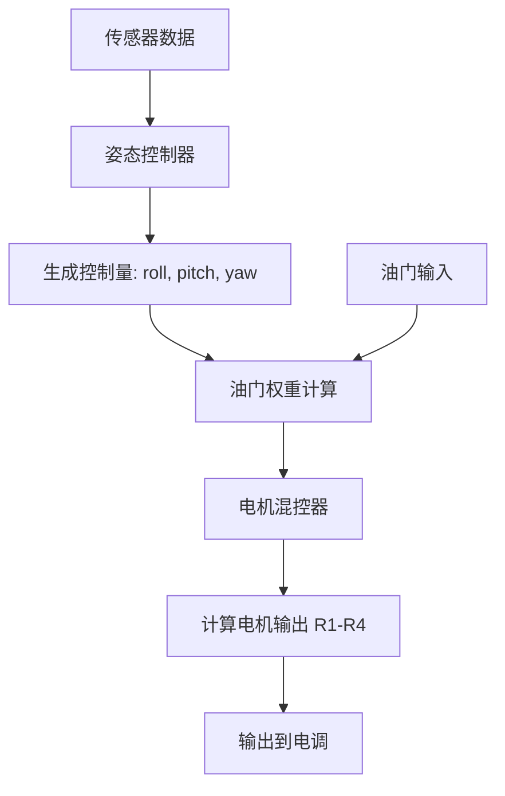
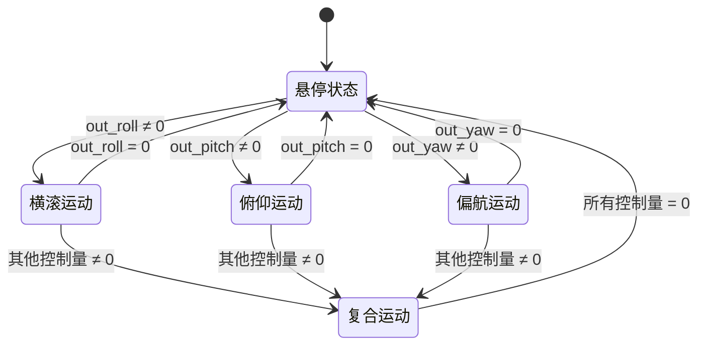
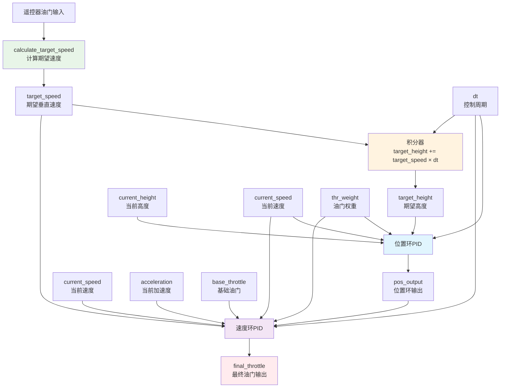

## 学习链接

1. [ESP32入门](https://blog.csdn.net/qq_33964936/article/details/133777605)
2. [ESP32入门学习2](https://www.bilibili.com/video/BV1tv411w74d?spm_id_from=333.788.videopod.episodes&vd_source=35e34a8c020f6931dec5585c4482ad05&p=4)
3. [ESP32开发环境配置](https://blog.csdn.net/weixin_43842462/article/details/123295842)
4. [ESP32学习视频](https://www.bilibili.com/video/BV1JS4y1H7Rm/?spm_id_from=333.337.search-card.all.click&vd_source=35e34a8c020f6931dec5585c4482ad05)
5. [arduino入门](https://www.bilibili.com/video/BV1yp421274U/?spm_id_from=333.337.search-card.all.click&vd_source=35e34a8c020f6931dec5585c4482ad05)
6. [立创ESP32开源](https://oshwhub.com/liguanxi/si-zhou-fei-xing-qi-ESP-Liguanxi)
7. [遥控器开源](https://oshwhub.com/a1077/ESP32yao-kong-qi-WIFI-MQTT-ESPNO)
8. [神书.四旋翼飞行器设计与实现](https://zh.z-library.sk/book/18259743/fab4eb/%E5%9B%9B%E6%97%8B%E7%BF%BC%E9%A3%9E%E8%A1%8C%E5%99%A8%E8%AE%BE%E8%AE%A1%E4%B8%8E%E5%AE%9E%E7%8E%B0.html)
7.[卡尔曼滤波在智能车中的应用](https://blog.csdn.net/m0_53966219/article/details/126806419)
8.[MPU6050与磁力计融合：攻克Z轴角度漂移的血泪史](https://blog.csdn.net/qq_45217381/article/details/149421958)
9.[逻辑分析仪的使用和安装](https://blog.csdn.net/qq_50930131/article/details/145970151)
10.[虚拟机的使用](https://blog.csdn.net/weixin_48384182/article/details/109693775)

## 基础编译学习

Arduino IDE 的三个主要函数的作用：
  

setup() 初始化一次，loop()

``` C++
void setup() {
  // 初始化设置，只运行一次
  pinMode(LED_BUILTIN, OUTPUT);
  int result = calculateSum(2, 3); // 调用自定义函数
}

void loop() {
  // 主循环，重复执行
  blinkLED(); // 调用自定义函数
  delay(1000);
}

// 自定义函数
int calculateSum(int a, int b) {
  return a + b;
}

void blinkLED() {
  digitalWrite(LED_BUILTIN, HIGH);
  delay(500);
  digitalWrite(LED_BUILTIN, LOW);
}
```

### ESP32S2-学习

ESP32-S2原理图：
  
  S2-mini点灯代码

``` C++

#include <Arduino.h>

// put function declarations here:
int myFunction(int, int);

void setup() {
  // put your setup code here, to run once:
  pinMode(LED_BUILTIN,OUTPUT);
}

void loop() {
  // put your main code here, to run repeatedly:
  digitalWrite(LED_BUILTIN,HIGH);
  delay(1000);
  digitalWrite(LED_BUILTIN,LOW);
  delay(1000);
}

// put function definitions here:
int myFunction(int x, int y) {
   

}

```

HW-724SSD1306 屏幕的使用

``` C++

#include <Wire.h>
#include "SSD1306.h"

// 初始化OLED显示，I2C地址0x3c，SCL引脚5，SDA引脚4
SSD1306 display(0x3c, 5, 4);

void setup() {
  // 初始化串口通信
  Serial.begin(115200);
  Serial.println("OLED显示屏初始化中...");

  // 初始化OLED显示
  display.init();
  
  // 垂直翻转屏幕（根据安装方向可选）
  display.flipScreenVertically();
  
  // 清空显示缓冲区
  display.clear();
  
  // ==================== 显示大标题 ====================
  display.setFont(ArialMT_Plain_24);     // 设置24点阵大字体
  display.setTextAlignment(TEXT_ALIGN_CENTER); // 文本居中对齐
  display.drawString(64, 10, "CZX");     // 在屏幕中心偏上显示
  
  // ==================== 显示副标题 ====================
  display.setFont(ArialMT_Plain_16);     // 设置16点阵字体
  display.drawString(64, 40, "Hello OLED!"); // 在中间显示
  
  // ==================== 显示底部信息 ====================
  display.setFont(ArialMT_Plain_10);     // 设置10点阵小字体
  display.setTextAlignment(TEXT_ALIGN_LEFT); // 左对齐
  display.drawString(0, 55, "ESP8266");  // 左下角显示芯片型号
  
  display.setTextAlignment(TEXT_ALIGN_RIGHT); // 右对齐
  display.drawString(128, 55, "2024");   // 右下角显示年份
  
  // 将缓冲区内容发送到显示屏
  display.display();
  
  Serial.println("文本显示完成！");
}

void loop() {
  // 空循环，只需要显示一次
  delay(1000);
}

```

#### ESP32的WIFI功能

## 四旋翼飞行器学习

### 卡尔曼滤波算法

#### 一个笑话

一片绿油油的草地上有一条曲折的小径，通向一棵大树。一个要求被提出：从起点沿着小径走到树下。

“很简单。”A说，于是他丝毫不差地沿着小径走到了树下。

现在，难度被增加了：蒙上眼。

“也不难，我当过特种兵。”B说，于是他歪歪扭扭地走到了树旁。“唉，好久不练，生疏了。”（只凭自己的预测能力）

“看我的，我有DIY的GPS！”C说，于是他像个醉汉似地歪歪扭扭的走到了树旁。“唉，这个GPS没做好，漂移太大。”（只依靠外界有很大噪声的测量）

“我来试试。”旁边一也当过特种兵的拿过GPS，蒙上眼，居然沿着小径很顺滑的走到了树下。（自己能预测+测量结果的反馈）

“这么厉害！你是什么人？”

“卡尔曼！”

“卡尔曼？！你就是卡尔曼？”众人大吃一惊。

“我是说这个GPS卡而慢。”

#### 卡尔曼滤波算法简介

>引入协方差，协方误差，协方误差
>>方差 是特殊的协方差（一个变量与自身的协方差），均方误差 是评估预测效果的重要指标，而协方差 是理解多个变量间关系的关键。
>>**均方误差 (MSE - Mean Squared Error)**
核心： 衡量 估计值 (或测量值) 与 真实值 之间的偏差程度。
特点： 评估的是“估计的准确性”或“测量的精确度”。误差越大，均方误差越大，说明估计或测量结果越不准确。
**方差 (Variance)**
核心： 描述 单个随机变量 自身的离散程度或波动大小。
特点： 衡量的是变量值围绕其 期望值（均值） 的波动情况。方差越大，数据越分散。
**协方差 (Covariance)**
核心： 描述 两个随机变量 之间的变化趋势及相关性。
特点：
正值 表示两变量变化趋势一致（你大我也大）。
负值 表示两变量变化趋势相反（你大我小）。
零 表示两变量没有线性相关关系
>>

#### 卡尔曼滤波的应用场景

1.当不能直接测量得到想要的数据时，应用卡尔曼滤波来间接测量
2.在有噪音情况下结合不同传感器来找到的最佳估计值

>如在飞控上的应用
>>姿态角估计
>>通过建立含有姿态角，角速度，加速度等状态量的模型，通过IMU的数据进行卡尔曼滤波，重新估计出状态量，间接得到姿态角的数据
>>位置估计（组合导航）：
>>加速度一次，二次积分可以得到速度，位置，GPS测量可以得到位置，通过卡尔曼滤波可以融合加速度计和GPS数据得到更精确的位置

智能车在卡尔曼滤波算法中的应用：

``` C++
/*************************************************************************
*  功能说明：卡尔曼滤波
*  修改时间：2021年5月26日
*************************************************************************/
int kalman_filter(kalman_param *kfp, int input)
{
     kfp->Now_P = kfp->LastP + kfp->Q;
     //卡尔曼增益方程差
     kfp->Kg = kfp->Now_P / (kfp->Now_P + kfp->R);
     //更新最优值方程
     kfp->out = kfp->out + kfp->Kg * (input-kfp->out);
     //更新协方差方程
     kfp->LastP = (1-kfp->Kg) * kfp->Now_P;
     return kfp->out;
}
```

### 四轴飞控发展历史

### 四轴飞控飞行原理

 四旋翼飞行器通过改变四个旋翼的转速，依据力的合成与扭矩平衡原理实现灵活飞行；其相邻旋翼转向相反、对角转向相同，并分别配以正、反螺旋桨来共同产生向上的升力，且所有旋翼均需向下吹风以确保提供向上的拉力。
  

### 四轴飞控的控制算法

#### PID控制

##### 飞控转向控制逻辑





| 运动类型 | 控制量 | 电机转速变化 |
|----------|--------|--------------|
| 横滚（Roll） | out_roll | 左右电机差动 |
| 俯仰（Pitch） | out_pitch | 前后电机差动 |
| 偏航（Yaw） | out_yaw | 对角电机差动 |
| 油门权重 | Thr_Weight | 小油门时抑制控制量 |

#### 高度控制和PID算法

>串极PID控制逻辑

``` text
遥控器输入 → 速度环PID → 位置环PID → 电机控制
     ↓              ↓           ↓
期望速度 ←    期望位置 ←   传感器反馈
```

PID代码是示例：

``` C++
/**
 * 多旋翼飞行器高度控制核心函数
 * 串级PID控制：位置环(外环) + 速度环(内环)
 */

#include <math.h>

// PID控制器结构
typedef struct {
    float kp, ki, kd;
    float err, err_i, err_d, err_old;
    float output;
} PID_Controller;

// 高度控制器结构
typedef struct {
    PID_Controller pos_pid;   // 位置环PID
    PID_Controller speed_pid; // 速度环PID  
    float target_height;      // 目标高度(mm)
    float target_speed;       // 目标速度(mm/s)
    float base_throttle;      // 基础油门
} Height_Controller;

/**
 * 位置环PID计算 - 控制高度
 */
float position_pid_update(PID_Controller* pid, float target, float current, 
                         float speed, float thr_weight, float dt) {
    // 比例项
    pid->err = pid->kp * (target - current);
    
    // 积分项（小油门时限制积分）
    pid->err_i += pid->ki * pid->err * dt;
    pid->err_i = constrain_float(pid->err_i, -thr_weight * 300, thr_weight * 300);
    
    // 微分项（60%速度反馈 + 40%误差微分）
    pid->err_d = pid->kd * (0.6f * (-speed * dt) + 0.4f * (pid->err - pid->err_old));
    pid->err_old = pid->err;
    
    return pid->err + pid->err_i + pid->err_d;
}

/**
 * 速度环PID计算 - 控制垂直速度  
 */
float speed_pid_update(PID_Controller* pid, float pos_output, float target_speed,
                      float current_speed, float acceleration, float base_throttle,
                      float thr_weight, float dt) {
    // 比例项
    pid->err = pid->kp * (target_speed - current_speed);
    
    // 微分项（加速度前馈）
    pid->err_d = (0.002f / 10.0f) * 10 * pid->kd * (-acceleration) * dt;
    
    // 积分项
    pid->err_i += pid->ki * pid->kp * (pos_output - current_speed) * dt;
    pid->err_i = constrain_float(pid->err_i, -thr_weight * 300, thr_weight * 300);
    
    // 最终油门 = 基础油门 + 带权重的PID修正
    float pid_sum = pid->kp * target_speed + pid->err + pid->err_d + pid->err_i;
    return base_throttle * 2 + thr_weight * constrain_float(pid_sum, -300, 300);
}

/**
 * 计算期望速度（带死区处理）
 */
float calculate_target_speed(float throttle) {
    float throttle_diff = throttle - 500; // 中位值500
    if (fabs(throttle_diff) <= 50) return 0; // 死区±50
    
    float deadzone_output = (throttle_diff > 0) ? (throttle_diff - 50) : (throttle_diff + 50);
    return 300.0f * deadzone_output / 200.0f; // 最大速度300mm/s
}

/**
 * 高度控制主函数
 */
float height_control_update(Height_Controller* ctrl, float current_height,
                           float current_speed, float acceleration, float throttle,
                           float thr_weight, float dt) {
    // 1. 计算期望速度
    ctrl->target_speed = calculate_target_speed(throttle);
    
    // 2. 更新期望高度（速度积分）
    ctrl->target_height += ctrl->target_speed * dt;
    
    // 3. 位置环PID
    float pos_output = position_pid_update(&ctrl->pos_pid, ctrl->target_height,
                                          current_height, current_speed, thr_weight, dt);
    
    // 4. 速度环PID
    return speed_pid_update(&ctrl->speed_pid, pos_output, ctrl->target_speed,
                           current_speed, acceleration, ctrl->base_throttle, thr_weight, dt);
}

// 约束函数
float constrain_float(float value, float min_val, float max_val) {
    if (value < min_val) return min_val;
    if (value > max_val) return max_val;
    return value;
}
```

>代码逻辑图



### 四轴飞控硬件

  四轴飞控硬件大致框架：
  

### 如何解决MPU6050零漂问题？

1.**我的想法是MPU6050加一个磁力技基础上在加一个滤波算法读出6050的值**

### 关于ESP32

ESP32是一款ESP32是一款高性能、低功耗的**Wi-Fi/蓝牙双模物联网芯片**，集成了丰富的外设和强大的计算能力。

>使用ESP32进行四轴飞控的开发，作为四轴飞控核心，凭借双核处理、硬件PWM和Wi-Fi/蓝牙一体化，可实现低成本高响应的无人机控制；适合轻量级应用，但复杂环境需优化实时性

### 机械方面
